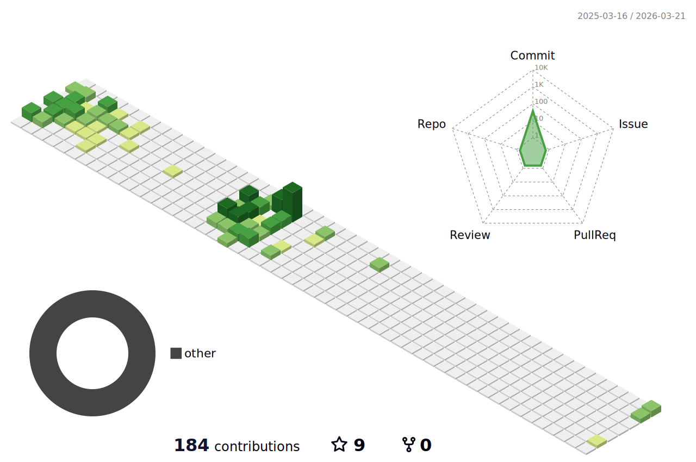

# 👋 Hi, I’m @MyoungGeun-Jang<h5>

### ✉ Feel free to contact me!
  jang23mg@naver.com 
### 📑 Check out my portfolio on GitHub!  
  https://github.com/MG-Jang/Portfolio
  
## 💼 Career

QBicware Co. – ITS Traffic AI Software Engineer
Nov 2024 – Present

AI Big Data Platform Training
Mar 2024 – Aug 2024

T-Robotics Co. – Smart Factory Software Engineer
Apr 2023 – Dec 2023

Samsung Software Academy for Youth (SSAFY), Seoul Campus
Jan 2022 – Dec 2022

## 🎓 Education

Hongik University, Seoul, KR
B.S. in Electronic & Electrical Engineering
Mar 2015 – Feb 2022

 ## Repositories📑
#### SAMSUNG SW ACADEMY FOR YOUTH Projects 
  - SAMSUNG-IOT-ROBOT-PJT-BOBI:  
  삼성전자(SSAFY)프로젝트 아이돌봄 로봇 보비  
  https://github.com/MG-Jang/SAMSUNG-IOT-ROBOT-PJT-BOBI
  - SAMSUNG AI Vision Autonomus-car-project: 
  삼성전자(SSAFY) 프로젝트(영상처리 기반 차량)  
  https://github.com/MG-Jang/Morai-autonomous-simulator

## 🛠️ Skills ✨

### 🚀 Language

### 👁️ Computer Vision AI 

### 🧱 Graphics 

### 📊 Data

### 🔌 Embedded Systems

### 🛠️ Back-end 

### ☁️ Infra

### 🛠️ Tools

<!---
MG-Jang/MG-Jang is a ✨ special ✨ repository because its `README.md` (this file) appears on your GitHub profile.
You can click the Preview link to take a look at your changes.
--->
